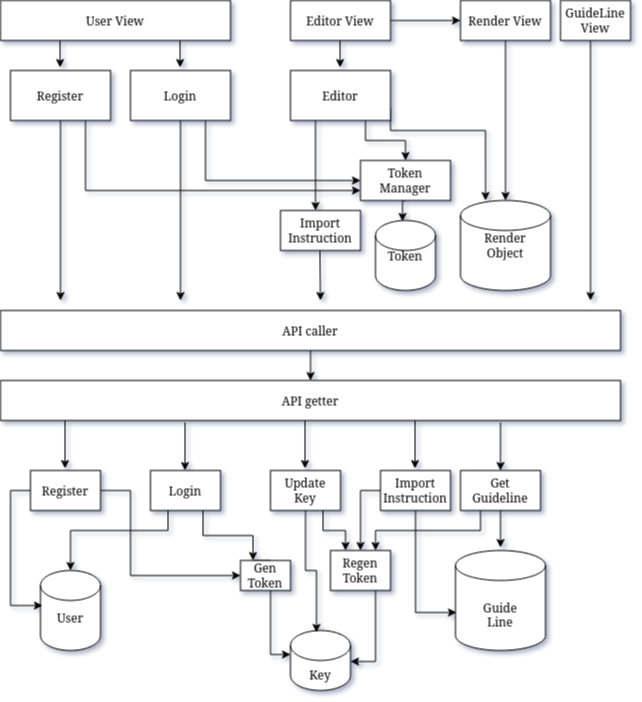

---
# pandoc tempplate.md -t beamer -o template.pdf
title:
- Python introduction
subtitle:
- Yet another python basic
author:
- Le Nhu Chu Hiep
theme:
- Ilmenau
toc:
- true
---

# Introduction
## History
- Author: Guido van Rossum
- Language name: BBC show “Monty Python’s Flying Circus”
- Type: Scripting language
- Philosophy: Batteries Include

## Setup
### Python SDK
- How to install python sdk ? google
- Linux: apt-get install python
- Arch repo: pacman -S python

## Setup
### Pip
- Python package manager: managing the python library
- Baisc syntax: list, install, uninstall

### Venv
- Initiation: python -m venv (name folder)
- Active: source (name folder)/bin/active -- Linux support
- Deactive: deactive -- Linux support

## How does Python work ?
### The fact
- Python is object-oriented programming language (everything is object)
- Python variable is pointer
- Python argument is "pass by value"
- Garbage colletor

### Symbol table
- Symbol table - a dictionary include metadata about declaration
- NameSpace - a kind of symbal table mapping variable name and object
- Scope - the accessible namespace

## What does Python support ?
### Baisc programming language
- Control Flow: if else, for, while, ...
- Data Structures: Sequence(List, Tuple, String, ...) and Dictionary

### Code distribution
- Module: a file include python script
- Package: a folder include modules or another packages

## Baisc programming language 
### Debugging
- Syntax Error
- Exception and Exception handler
- Exception Raising and User-define Exception
- Clean-up Action

### Testing
- Quality Control

## Baisc programming language
### Function supporting
```
def func_name(args):
    pass
```

### Class supporting
```
class class_name(parent_class1, parent_class2):
    attribute
    def method_func():
        pass
```

### Weak and half-strong type support
- weak-type: Do not need to declare variable
- half-strong type: can control data-type input and output of function

## Basic programming language
### Input and output
- Fancier Output Formatting
- File Handler

## Baisc programming language
### Document supporting
- docstring

### Code style
- PEP-8

### delimiter
- Seperate command: newline
- Seperate block: space

## Standard Library
- A Huge baterries including:
```
OS interface, string pattern handling, mathematic,
Internet Access, Data and Time, Multi-threading, ...
```

# Data Processing
## Numpy and Pandas
- Numpy is a library providing high performance multidimensional array object and tools for working with this array.

- Pandas is a library built on top of numpy providing
high-performance, easy-to-use data structures and data
analysis tools.

# Flask
## Introduction
- Flask is a lightweight WSGI web application framework. It begin as a simple wrapper around Werkzeug and Jinja. It does not
contain many dependencies, instead, it support extensions to add more functionality to the application as if it was implemented in flask itself.

## Dependencies
- Jinja : Templeting engine
- Werkzeug : WSGI web application library

## Design decisions in flask
- The Explicit Application Object
- The Routing System
- One Template Engine
- Thread Locals
- Micro with Dependencies
```
https://flask.palletsprojects.com/en/1.1.x/design/#design
```

# JWT(Json Web Token)
## JWT Introduction
- JSON Web Token (JWT) is an open standard (RFC 7519) that defines a compact and self-contained way for securely transmitting information between parties as a JSON object. 

## JWT Structure
### Part
- Header
- Payload
- Signature

### Header
- type token
- signing algorithm
- Base64 encoding

## JWT Structure
### Payload
- claiming data
- Base 64 encoding

### Signature
- Base64(header) + "." + Base64(payload)
- Secret key
- Base64 encoding

### Interface
- Look like: xxx.yyyyy.zzzz

# Backend Pattern
## Architecture
{height=256px}

# Swagger
## Introduction
- Swagger is set of tools suround the openAPI specification to design, build, document and use RESTful-API

## Tools set
- Swagger Editor : editor tool to write openAPI specs
- Swagger UI     : render interactive API doc
- Swagger Codegen: generate server stub and client library

## Why using swagger UI
- Swagger describes the API by common language that is readable by human and machine.
- Swagger UI simplify the process of documenting API.
- API doc generated is friendly and easy to read and understand.

## Swagger UI and flask